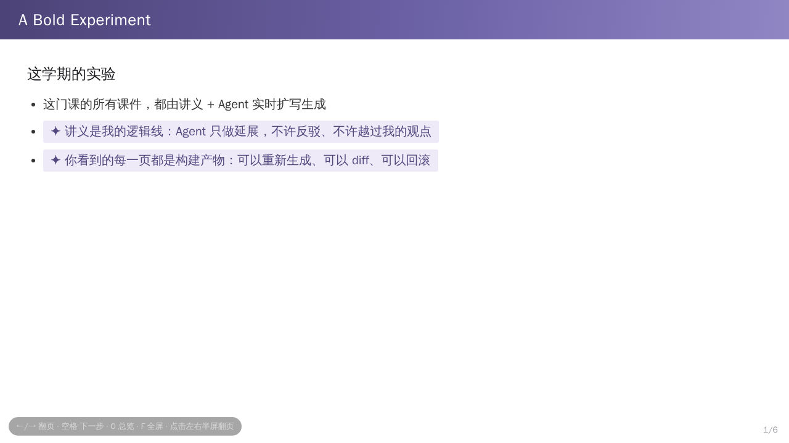
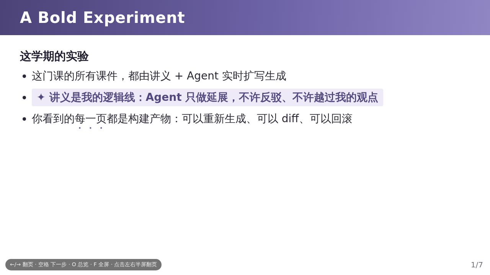
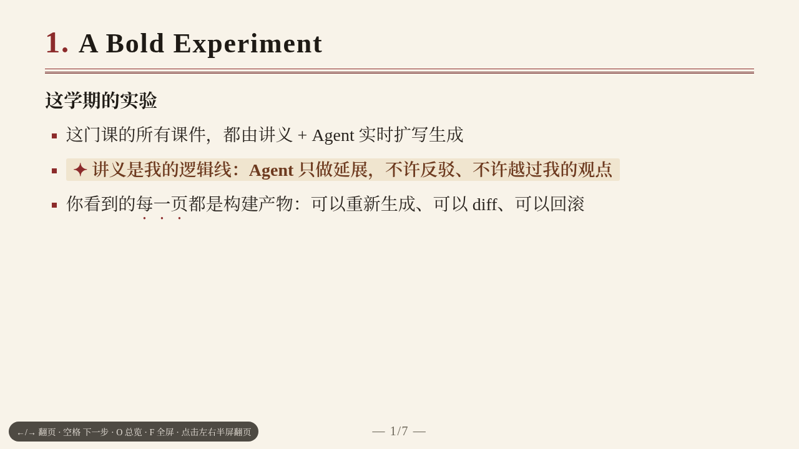
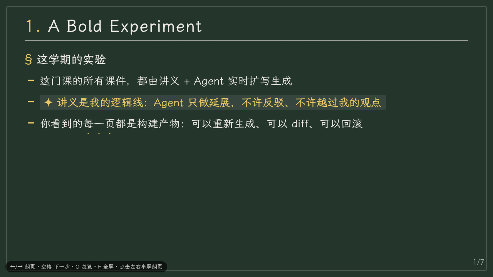
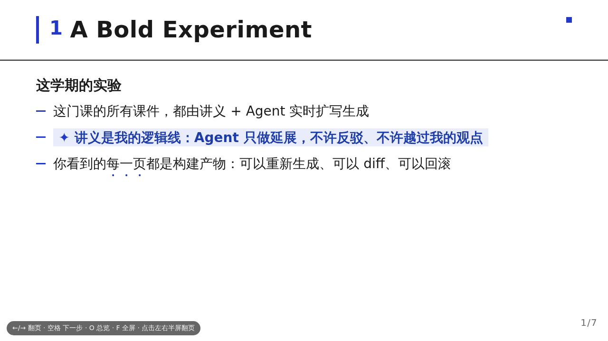

<div align="center">

[简体中文](README.md) · [**English**](README_EN.md)

# 🎓 mdshow-slides · Lecture Notes as Code

**Write your lecture in Markdown, build a single-file HTML slide deck with one command**

The Markdown source is the single source of truth; slides are just build artifacts — diffable, revertible, and reproducible.

[](LICENSE)
[](https://www.python.org/)
[](README_EN.md#features)
[](README_EN.md#quick-start)
[](https://github.com/ChenChen913/html-presentation-v2/pulls)

[](https://github.com/ChenChen913/html-presentation-v2/stargazers)
[](https://github.com/ChenChen913/html-presentation-v2/issues)

</div>

---

## What is this

**mdshow-slides** is a "lecture notes as code" workflow: you only write Markdown; the build engine compiles it into a **single-file HTML** — engine, theme, and content all inlined. Double-click to present. No network, no dependencies, no web fonts. The builder is implemented in pure Python standard library (~700 lines) and runs on any machine with Python 3.8+.

It is also an **AI Agent Skill**: the repository itself follows the standard three-layer skill layout (`SKILL.md` main flow + `references/` deep-dive docs + `assets/` ready-to-use resources). Drop it into `.agents/skills/` and your coding agent can draft, build, and verify slides for you following the built-in conventions.

- **Five themes**: from a 1:1 replica of a Nanjing University lecture deck to journal-style serif, chalkboard, and Swiss typographic styles
- **Five university color systems**: Purple (NJU) / Green (WHU) / Red (PKU) / Blue (ZJU) / Black (Ink), each with officially verified colors
- **Honest AIGC labeling**: AI-expanded content gets a recognizable watermark tint — being honest to your audience

## Features

| Feature | Description |
|---|---|
| Notes as code | Markdown is the single source of truth; regenerate slides anytime; style and content evolve independently |
| Two dialects, auto-detected | Human-written notes (`##` per slide) and make-slides output (`---` separators) parse correctly out of the box |
| Single-file delivery | One HTML file (15–27 KB) — Git-friendly, emailable, offline-presentable |
| Full presenting UX | `←/→` navigate · Space for fragments · `O` overview grid · `F` fullscreen · click/swipe · `#/n` deep link |
| AIGC watermark | Wrap AI-expanded text in `<span class="aigc">`; themes render a ✦ watermark tint so the audience always knows |
| Print = PDF | `@page` is pre-configured for 1280×720; export handouts straight from the browser print dialog |
| Image placeholders | `[[caption]]` renders a dashed placeholder card and warns in the build log until you add the real image |
| Typography compliance | Font-size ladder, contrast ≥ 4.5:1, strict line-breaking, emphasis dots instead of fake italics, `prefers-reduced-motion` — all built in |

## 🚀 Quick Start

```bash
# 1. Get the engine (this repo IS the skill directory; engine lives in assets/)
git clone https://github.com/ChenChen913/html-presentation-v2.git
cd html-presentation-v2

# 2. Write a lecture (start from the demo)
cp assets/demo/lecture-demo.md my-lecture.md

# 3. Build (--theme to switch themes; default is v2 Zitan)
python3 assets/engine/buildall my-lecture.md -o slides.html \
    --theme references/themes/theme-v3-paper-journal.css
```

When the build finishes, double-click `slides.html` to present. Keys: `←/→` navigate · `Space` next fragment · `O` overview · `F` fullscreen · click right half to advance. Export PDF via the browser print dialog (page size is pre-configured).

> Want to see the result first? Open any of the five ready-made decks in [`assets/showcase/`](assets/showcase/) — double-click to present.

## Five Themes

Real build artifacts of the same lecture under all five themes (full-size files in [`assets/showcase/`](assets/showcase/)):

<table>
  <tr>
    <td align="center"><br><sub><b>v1 Violet Lectern</b> · 1:1 jyy replica</sub></td>
    <td align="center"><br><sub><b>v2 Zitan</b> · modern standard (default)</sub></td>
    <td align="center"><br><sub><b>v3 Paper Journal</b> · serif · journal rules</sub></td>
  </tr>
  <tr>
    <td align="center"><br><sub><b>v4 Chalkboard</b> · chalk on board · Kaiti</sub></td>
    <td align="center"><br><sub><b>v5 Swiss Blueprint</b> · white · Klein blue</sub></td>
    <td align="center"><sub><a href="assets/showcase/"><b>▶ Open showcase</b><br>five ready-made decks<br>double-click to present</a></sub></td>
  </tr>
</table>

| Theme | Template | Style | Best for |
|---|---|---|---|
| v1 Violet Lectern | `theme-v1-nju-replica.css` | Faithful replica of the original lecture deck | Classroom authenticity (do not recolor) |
| v2 Zitan | `theme-v2-zitan.css` | Modern standard, purple gradient blocks | General academic talks (**default**) |
| v3 Paper Journal | `theme-v3-paper-journal.css` | Serif, warm paper, double journal rules | Humanities / paper presentations |
| v4 Chalkboard | `theme-v4-chalkboard.css` | Chalk on blackboard, Kaiti face | Large lectures |
| v5 Swiss Blueprint | `theme-v5-swiss-blueprint.css` | White, ink black, Klein blue, sharp 90° rules | Engineering / design topics |

## University Color Systems

Beyond the theme skeletons, every theme (v2–v5) can be recolored to an official university palette with one override snippet ([`assets/palettes/`](assets/palettes/); sources and full token maps in [`references/university-palettes.md`](references/university-palettes.md)):

| Color | University | Official standard color | Snippet |
|---|---|---|---|
| Purple | Nanjing University | NJU Purple C50 M100 Y0 K40 (2010 VI standard) | `palette-purple.css` |
| Green | Wuhan University | Luojia Green `#115740` (official site) | `palette-green.css` |
| Red | Peking University | PKU Red `#94070A` (identity office) | `palette-red.css` |
| Blue | Zhejiang University | Qiushi Blue ≈`#003F88` (university VI) | `palette-blue.css` |
| Black | Ink (universal) | Chromatic-free academic style, fits any school | `palette-black.css` |

How to recolor (append-override, verified): copy the `:root` block for your theme from the snippet file and **append it to the end of the theme CSS**, save as a new theme, and build as usual — in CSS, later variable declarations win, and the original theme stays untouched. v2–v5 are fully tokenized, so recoloring is zero-risk.

## Syntax Cheat Sheet

Two dialects are auto-detected, zero configuration:

| | Dialect A "human notes" | Dialect B "make-slides output" |
|---|---|---|
| Slide break | `## Title` (an H2 starts a new slide) | `---` horizontal rule |
| Cover | First `# H1` in the document | First slide is the cover |
| Fragments | List items appear step by step | Same (item-by-item reveal) |

Inline syntax: `**bold**` · `*emphasis*` (rendered as emphasis dots, never fake italics) · `` `code` `` · `[link](url)` · `<span class="aigc">AI-expanded text</span>` (AIGC watermark) · `[[image caption]]` (dashed placeholder)

Full syntax table → [`references/dialect-syntax.md`](references/dialect-syntax.md); authoring rules (≤8 bullets per slide, AIGC boundaries, etc.) → [`SKILL.md`](SKILL.md) and [`references/content-workflow.md`](references/content-workflow.md).

## Use as an AI Skill

The repository root is the skill directory, following the three-layer Agent Skill convention (progressive disclosure: the main file keeps only the main flow; depth lives one click away):

```bash
mkdir -p .agents/skills
git clone https://github.com/ChenChen913/html-presentation-v2.git .agents/skills/mdshow-slides
```

Then just tell your agent: "**use mdshow-slides to turn this lecture into slides**". Inside the skill:

- `SKILL.md` — main flow: pick a theme, recolor, authoring rules, build commands (~100 lines, deliberately lean)
- `references/` — full syntax / content workflow / design system / university colors / engine pitfalls / field notes / five theme templates
- `assets/` — presentation engine / palette snippets / demo lectures / five showcase decks

## Repository Layout

```
html-presentation-v2/
├── README.md                       # this file (Chinese, default)
├── README_EN.md                    # English version
├── LICENSE                         # MIT
├── SKILL.md                        # ★ skill main file (main flow)
├── references/
│   ├── dialect-syntax.md           #   full syntax of both dialects
│   ├── content-workflow.md         #   content generation workflow (snippet storyline / fan-out)
│   ├── design-system.md            #   design rules + five theme profiles
│   ├── university-palettes.md      #   five color systems × official university colors
│   ├── engine-internals.md         #   engine internals / verification checklist / known pitfalls
│   ├── lessons-learned.md         #   field notes from real builds (must-read for long decks)
│   └── themes/                     # ★ five theme template CSS files
└── assets/
    ├── engine/                     # ★ presentation engine (pure Python + runtime.js)
    ├── palettes/                   # ★ five color-system override snippets
    ├── demo/                       #   demo lectures
    └── showcase/                   # ★ five ready-made decks (HTML + screenshots)
```

## 🙏 Acknowledgments

This workflow is inspired by the course slides of **Prof. Jiang Yan-Yan (jyy) at Nanjing University**
(Operating Systems / Generative Software Engineering) and his `make-slides` skill workflow:
the lecture notes are the single source of truth, slides are build artifacts, and everything
AI-expanded is honestly marked with an `.aigc` watermark. Hats off to jyy for open-sourcing this workflow.

- Theme v1 in this repo is a 1:1 replica of his lecture-deck style, for learning purposes only.

## License

[MIT](LICENSE) © 2026 ChenChen913

University colors referenced in the themes come from publicly published visual-identity standards and belong to their respective universities; they are used here for learning and communication only.

<div align="center">

**If this project helps you, please consider giving it a ⭐**

</div>
