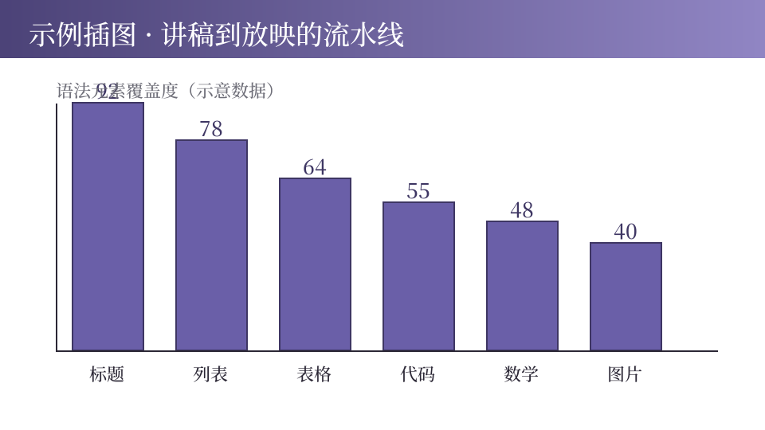

# Markdown 全格式测试

mdshow 引擎语法覆盖验证稿 · 一份稿子测尽所有格式

## 标题与段落

### 三级小节句

这是普通段落，验证默认字号、行高与中文避头尾。
紧邻的物理行会合并为同一段落（中文直排，不断句）。

- **粗体**：强调关键词
- *着重号*：中文语境代替斜体
- ~~删除线~~：弱化或订正的表述
- `行内代码`：标记术语与文件名
- ***粗斜体***：粗体与着重号叠加（新增）
- [超链接](https://github.com/ChenChen913/html-presentation-v2)：外链样式 {nf}

## 无序列表与嵌套

- 顶层列表项，默认分步显示
  - 嵌套子项随父项一同出现
  - 第二个嵌套子项，验证缩进层级
- 行尾写 {nf} 可关闭分步
- > 列表内 AIGC 水印卡（✦ 前缀）
- 同级列表项间距一致，嵌套层缩进递进 {nf}

## 有序列表（新增支持）

1. 第一步：解析 Markdown 源稿为幻灯片模型
2. 第二步：模型渲染为 HTML 结构
3. 第三步：内联主题 CSS 与放映 JS，产出单文件

有序列表与无序列表分步规则一致；下面隔一个段落再起新表，起始号直接取自首项：

9. 从九号起算的列表（渲染为 start=9）
10. 后续项自动顺延，不依赖书写数字

## 表格（新增支持）

| 行内语法 | 书写示例 | 渲染效果 | 备注 |
|:---------|---------|:--------:|-----:|
| 粗体 | 星号包裹 | **重点词** | 常用 |
| 着重号 | 星号单包 | *强调词* | 中文规范 |
| 删除线 | 双波浪 | ~~作废项~~ | 订正 |
| 链接 | 方括号 | [示例](https://example.com) | 外链 |
| 数学 | 美元符 | $E=mc^2$ | 行内公式 |

表头深字、斑马纹、四档对齐（左/默认/居中/右）全部生效。

## 代码块（新增支持）

```python
def fib(n):
    a, b = 0, 1
    while a < n:
        print(a, end=" ")
        a, b = b, a + b

fib(100)  # 0 1 1 2 3 5 8 13 21 34 55 89
```

围栏代码块：等宽字体、深底浅字、右上角语言徽标；代码内容原样转义，不做行内解析（标记符号与美元符都安全）。

## 任务列表（新增支持）

- [x] 已完成：表格语法与四档对齐
- [x] 已完成：围栏代码块与语言徽标
- [ ] 进行中：新元素样式逐项目检
- [ ] 待办：示例收编入仓库
- 普通列表项可与任务项混排

## 数学全家桶

行内公式：质能方程 $E=mc^2$，复杂度 $O(n \log n)$，条件概率 $P(x \mid y)$。

$$P(x_{1:n} \mid c) = \prod_{i=1}^{n} P(x_i \mid c, x_{1:i-1})$$

展示公式独立成行居中；词性分明排版：单字母变量斜体、函数名与多字母标识符正体、大 O 记号保持正体、条件竖线自动留气口。

## 引用块与水印

> 引用块是容器：大引号加左竖线，适合摘录原话与需求。
> <span class="aigc">内部嵌 AIGC 水印，容器与标记正交。</span>

引用块不计入分步，翻页即整块出现。

## 真实图片（新增支持）



整行图片渲染为居中图版：限高防溢出、圆角加投影；支持本地相对路径与网络 URL。

## 占位卡对比

[[一张架构图：讲稿到放映的流水线]]

整行双括号渲染为虚线占位卡，构建时控制台告警提醒补图；行内出现则收窄为小占位标记，如 [[占位]]。两者配合：写稿期用占位，定稿期换真实图片。

## 方言与语法边界

- 本稿为方言 A（## 分页，人类讲稿）；方言 B（--- 分页）见 demo 讲稿
- 独立三横线行会让整篇按方言 B 解析：慎用水平分隔线
- 暂不支持：脚注、定义列表、块级 HTML、多行单元格
- 单元格内竖线无法转义：含竖线内容请改用行内代码
- 转义序列（反斜杠）未实现：数学式内写美元符需绕行

## 版本信息

- 验证稿 v1.0 · 2026-09
- mdshow 引擎：纯 Python 标准库，零依赖
- 构建命令：buildall dialect-test.md -o dialect-test.html
- 本页同时验证：页码、总览模式、打印导出与全稿收尾样式
